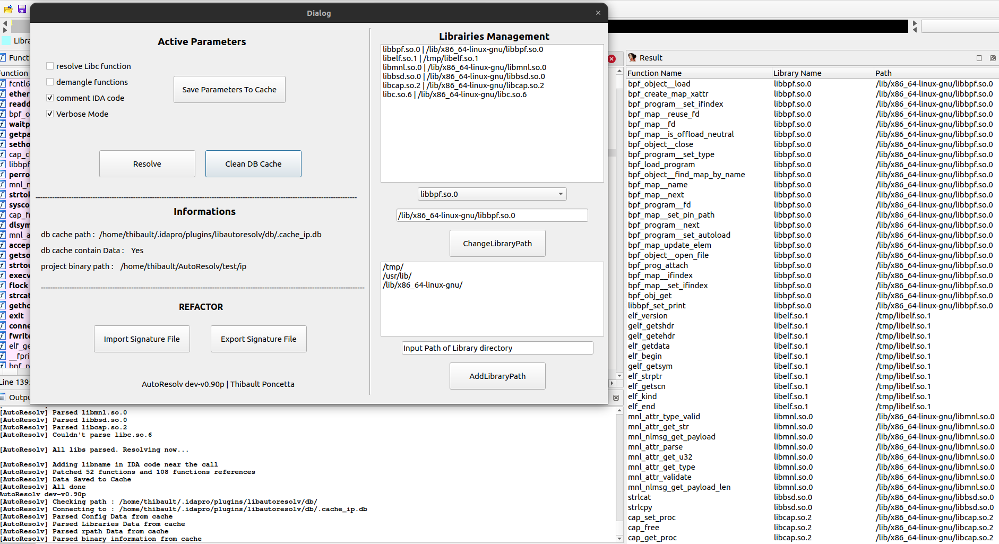

## AutoResolv : IDA Plugin

__AutoResolv__ is a free and open source (GPLv2) IDA plugin, which resolves functions imported from external libraries. 

You meet a jump to an external function and you have no clue where this function is implemented? 
You want to know what parameters are actually used in the signature of the external function? 

Then AutoResolv can be useful.

.

AutoResolv will give you those informations : 

- Create a window Result that will contain function_name | libcustom.so | path of libcustom | [optional parameters]
- Create a comment specifying the name of the implementing library is the wrapper and cross-reference the origin of the function
- Import function signature from custom libraries and refactor the function call type inside the binary
- See libraries that are linked to binary

AutoResolv use db caching for optimisation. You can clear the cache at any time if you want to resolve new data or clear old data.

#### Architecture supported : x86-64, x86, Mips, PowerPC, ARM, aarch64. 
#### Only ELF binary are supported for the moment.

# Requirements 

AutoResolv will look for libraries from original binary. If the linked libraries aren't on your computer or inaccessible, the tool won't work. 

- IDA > 7.0 (IDA Python is required)
- pyqt5 is required
- pyelftools is required
- HexRays decompilator for the target architecture

# Preview

.


.


# Additional features

- __libc__ parameters: if this option is unchecked, AutoResolv won't print libc standard function resolved libc location. Unchecked by default
- __demangle__ parameters: if this option is checked, AutoResolv will demangle C++ functions and output in the results. Activated by default
- __comment__ parameters: if this option is checked, AutoResolv will create a comment near the function call in IDA code. The comment is the library implementing the external function. (Warning : this can be very slow if you have a large group of functions / external functions.) Activated by default
- __verbose__: Print all AutoResolv debug to stdout. Activated by default


# Installation

```bash
pip3 install pyqt5 pyelftools lief
cp AutoResolv.py libautoresolv -r path/to/your/idapro/plugins/
```

# Usage 

AutoResolv can be used on a single binary. But if you want to use Export/Import functionnality, you must open another instance of the libcustom.so | libcustom2.so, ... and press Export buttons. Choose the main binary database of your project and then confirm. 

When this is done, just click Import on main binary and AutoResolv will refactor wrapper and Xrefs with the function signature of the customlib.


##### Warning : For optimisation purposes, you must use Resolve buttons at least once in main binary. Export functionnality won't work if data (resolved functions) isn't found in the DB cache.
##### Warning : Export uses idaapi.decompile() so it can be pretty long if you have a lot of functions inside the library. 


# Bugs

IDA plugins was mainly tested on ELF x86-64. 
Support has been added for i386, ARM, aarch64, PowerPC and MIPS but bugs will probably occur. 
Feel free to open issues or contact at thibault.poncetta@gmail.com. 

# TODO, potential future work

- V2 New version : 
  - C++ lib version
  -  use of idat64 for graphical less IDA => no need for new instance to import librairies functions. 
  -  automatically import auto-generated struct / manual struct / typedef required for the functiion call type
  -  More architecture/Support/less bug